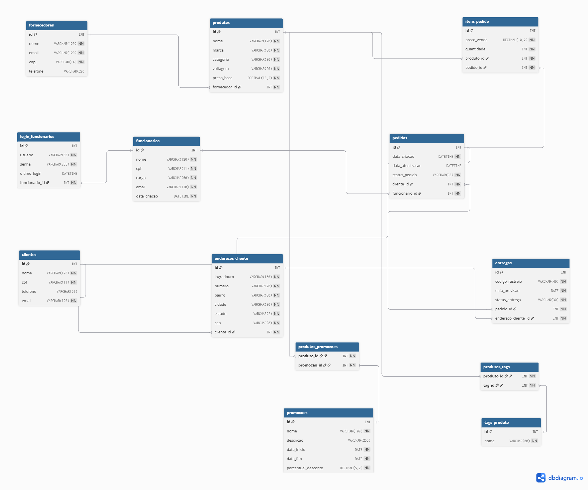

# Sistema de Estoque

API REST em Spring Boot para gerenciar o estoque e as vendas de uma loja de eletrodomesticos. O sistema controla fornecedores, produtos, clientes, funcionarios, pedidos, itens de pedido, entregas, promocoes e tags de produtos.

## Proposta

O dominio escolhido representa uma loja que precisa manter seu catalogo de produtos, registrar fornecedores, cadastrar clientes e criar pedidos de venda. A solucao expoe endpoints REST com camadas separadas de controller, service e repository, usando JPA com banco H2 em memoria.

Principais recursos:

- CRUD de clientes, fornecedores e produtos.
- Criacao, consulta, alteracao de status e exclusao de pedidos.
- Validacao de entrada com Bean Validation.
- Autenticacao com Spring Security e JWT.
- Documentacao dos endpoints com Swagger/OpenAPI.
- Carga inicial de dados para facilitar testes locais.

## Tecnologias

- Java 21
- Spring Boot
- Spring Web MVC
- Spring Data JPA
- Spring Security
- JWT
- Bean Validation
- H2 Database
- Swagger/OpenAPI
- Maven

## Como executar localmente

Verifique o Java:

```bash
java -version
```

Na pasta raiz do projeto, execute:

```bash
./mvnw spring-boot:run
```

No Windows:

```bash
mvnw.cmd spring-boot:run
```

A aplicacao sobe em:

```text
http://localhost:8085
```

## Acessos uteis

Swagger/OpenAPI:

```text
http://localhost:8085/swagger-ui/index.html
```

H2 Console:

```text
http://localhost:8085/h2-console
```

Dados de conexao do H2:

```text
JDBC URL: jdbc:h2:mem:estoque
User Name: sa
Password: sa
```

## Autenticacao

Antes de acessar os endpoints protegidos, gere um token:

```http
POST /api/auth/login
Content-Type: application/json

{
  "usuario": "calmeida",
  "senha": "123456"
}
```

Exemplo de resposta:

```json
{
  "tipo": "Bearer",
  "token": "eyJhbGciOiJIUzI1NiIsInR5cCI6IkpXVCJ9..."
}
```

Use o token nas proximas requisicoes:

```text
Authorization: Bearer SEU_TOKEN
```

## Exemplos de execucao

Criar fornecedor:

```http
POST /api/fornecedores
Authorization: Bearer SEU_TOKEN
Content-Type: application/json

{
  "nome": "Tech Distribuidora",
  "email": "contato@techdistribuidora.com",
  "cnpj": "11222333000144",
  "telefone": "1133334444"
}
```

Resposta:

```json
{
  "id": 2,
  "nome": "Tech Distribuidora",
  "email": "contato@techdistribuidora.com",
  "cnpj": "11222333000144",
  "telefone": "1133334444"
}
```

Criar produto:

```http
POST /api/produtos
Authorization: Bearer SEU_TOKEN
Content-Type: application/json

{
  "nome": "Micro-ondas 32L",
  "marca": "Electrolux",
  "categoria": "Cozinha",
  "voltagem": "110V",
  "precoBase": 799.90,
  "fornecedorId": 1,
  "promocaoIds": [],
  "tagIds": []
}
```

Criar pedido:

```http
POST /api/pedidos
Authorization: Bearer SEU_TOKEN
Content-Type: application/json

{
  "clienteId": 1,
  "funcionarioId": 1,
  "itens": [
    {
      "produtoId": 1,
      "quantidade": 2
    }
  ]
}
```

Resposta:

```json
{
  "id": 2,
  "statusPedido": "CRIADO",
  "clienteId": 1,
  "cliente": "Mariana Silva",
  "funcionarioId": 1,
  "funcionario": "Carlos Almeida",
  "itens": [
    {
      "produtoId": 1,
      "produto": "Geladeira Frost Free 400L",
      "quantidade": 2,
      "precoVenda": 3499.90,
      "subtotal": 6999.80
    }
  ],
  "total": 6999.80
}
```

## Endpoints principais

- `POST /api/auth/login`
- `GET /api/clientes`
- `POST /api/clientes`
- `PUT /api/clientes/{id}`
- `DELETE /api/clientes/{id}`
- `GET /api/fornecedores`
- `POST /api/fornecedores`
- `PUT /api/fornecedores/{id}`
- `DELETE /api/fornecedores/{id}`
- `GET /api/produtos`
- `POST /api/produtos`
- `PUT /api/produtos/{id}`
- `DELETE /api/produtos/{id}`
- `GET /api/pedidos`
- `POST /api/pedidos`
- `PUT /api/pedidos/{id}`
- `PATCH /api/pedidos/{id}/status`
- `DELETE /api/pedidos/{id}`
- `GET /api/enderecos`
- `POST /api/enderecos`
- `PUT /api/enderecos/{id}`
- `DELETE /api/enderecos/{id}`
- `GET /api/funcionarios`
- `POST /api/funcionarios`
- `PUT /api/funcionarios/{id}`
- `DELETE /api/funcionarios/{id}`
- `GET /api/logins-funcionarios`
- `POST /api/logins-funcionarios`
- `PUT /api/logins-funcionarios/{id}`
- `DELETE /api/logins-funcionarios/{id}`
- `GET /api/itens-pedido`
- `POST /api/itens-pedido`
- `PUT /api/itens-pedido/{id}`
- `DELETE /api/itens-pedido/{id}`
- `GET /api/entregas`
- `POST /api/entregas`
- `PUT /api/entregas/{id}`
- `DELETE /api/entregas/{id}`
- `GET /api/promocoes`
- `POST /api/promocoes`
- `PUT /api/promocoes/{id}`
- `DELETE /api/promocoes/{id}`
- `GET /api/tags-produto`
- `POST /api/tags-produto`
- `PUT /api/tags-produto/{id}`
- `DELETE /api/tags-produto/{id}`

## Modelo de dados

O DER do projeto esta no arquivo abaixo:


